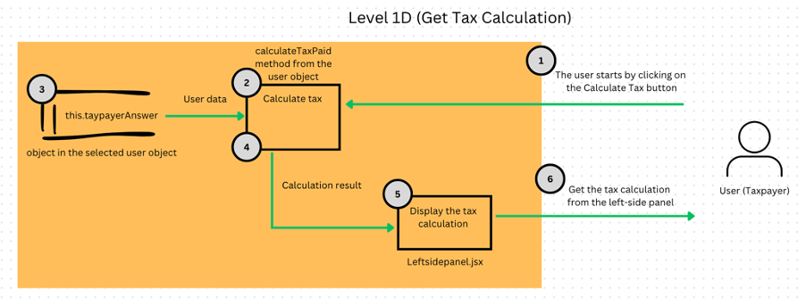

# H446 A Level Computer Science Coursework

\*Only DESIGN section is included in the README.md. ANALYSIS, DEVELOPMENT AND TESTING and EVALUATION are not included.

\*Usability Features, Justification of Class, Attributes and Methods, Subroutines and States are not included in the DESIGN section.

Click <a href="https://marco-cs-portfolio.netlify.app/">here</a> for the project demo link.

# DESIGN

- [Decomposing My Problem](#decomposing-my-problem)
- [User Interface Design](#user-interface-design)
- [Object-Oriented Programming in React](#object-oriented-programming-in-react)
  - [My journey in implementing OOP to this application](#my-journey-in-implementing-oop-to-this-application)
  - [The Class Diagram](#the-class-diagram)
- [Data Structures](#data-structures)
  - [botQuestion array](#botquestion-array)
  - [surveyResult object](#surveyresult-object)
  - [taxpayerAnswer object](#taxpayeranswer-object)
  - [sentenceBank array and botPreMadeReply array](#sentencebank-array-and-botpremadereply-array)
- [Data Flow Diagrams](#data-flow-diagrams)
  - [Level 0](#level-0)
  - [Level 1A (Get The Pre-made Reply)](#level-1a-get-the-pre-made-reply)
  - [Level 1B (Ask The ChatGPT)](#level-1b-ask-the-chatgpt)
  - [Level 1C (Start Advisor Chat)](#level-1c-start-advisor-chat)
  - [Level 1D (Get Tax Calculation)](#level-1d-get-tax-calculation)
  - [Level 1E (Generate Report)](#level-1e-generate-report)
  - [Level 1F (Edit the survey or Income answer)](#level-1f-edit-the-survey-or-income-answer)
  - [Level 1G (Download report to text file)](#level-1g-download-report-to-text-file)
  - [Level 1H (Import the user data)](#level-1h-import-the-user-data)
  - [Level 1I (Export the user data)](#level-1i-export-the-user-data)
  - [Level 1J (Create multiple user account)](#level-1j-create-multiple-user-account)
  - [Level 1K (Switch between user accounts)](#level-1k-switch-between-user-accounts)
  - [Level 1L (Delete a user account)](#level-1l-delete-a-user-account)
- [Algorithms](#algorithms)
  - [Binary Search For a Reply In Pre-made Reply Mode](#binary-search-for-a-reply-in-pre-made-reply-mode)
    - [Trigger the Pre-made Reply](#trigger-the-pre-made-reply)
    - [Initialize the binary search](#initialize-the-binary-search)
    - [The binary search](#the-binary-search)
  - [How The Tax Should Be Calculated](#how-the-tax-should-be-calculated)
  - [How The Application Responds to The User in Advisor Chat Mode](#how-the-application-responds-to-the-user-in-advisor-chat-mode)
  - [Check whether the user is a UK resident (Part of the How The Application Responds to The User in Advisor Chat Mode)](#check-whether-the-user-is-a-uk-resident-part-of-the-how-the-application-responds-to-the-user-in-advisor-chat-mode)
- [Connecting ChatGPT API](#connecting-chatgpt-api)
  - [Using ChatGPT API in the Rightsidepanel.jsx](#using-chatgpt-api-in-the-rightsidepaneljsx)
  - [Using ChatGPT API in the Reportsection.jsx](#--using-chatgpt-api-in-the-reportsectionjsx)
- [Test Plans](#test-plans)
  - [Iterative Testing](#iterative-testing)
  - [Post-development Testing](#post-development-testing)

## Decomposing My Problem

- Decomposition is used in the design of my application to break my complicated system down into several smaller programs. It is because this can make my development workflow more straightforward to follow.

- My first task is to decompose my application into four sections – the header section, the right-side panel section, the left-side panel section, and the report section. Part of the reason that it is decomposed in this way is because of its functionalities. The other reason is that the sections are actually because of the common visual arrangement on the webpage. For instance, the header section controls the user account because most web pages involving user account management are allocating the user account service in the header. The left side of the webpage commonly provides information that the user can select, and the right side usually has the highest interactive activities. The report section can only provide information when the tax is calculated, and hence, it is below all the other sections.

Below is a decomposition diagram for this Tax Advisor Application:

## User Interface Design

- Having the problem decomposed into smaller programs, I can now draw wireframe for my application.

Below shows the wireframe of this Tax Advisor Application:

## Object-Oriented Programming in React

### My journey in implementing OOP to this application

- Before going into the class diagram, I would like to mention a difficulty I faced while implementing object-oriented programming in my React project.

- This is my first project to use object-oriented programming. I thought using OOP in React would be different from JavaScript/HTML/CSS projects because React uses the state hook to save variables and control how the data is accessed across various components, which is quite different from JavaScript/HTML/CSS projects. However, I also know that React is a JavaScript library, and the rules from JavaScript would apply to React.

- The first thing that came to my mind when starting the project was to find OOP in React directly on a search platform, and then I found these two websites: <a href="https://javascript.plainenglish.io/object-oriented-programming-in-react-ba0ad4275e35">Link01</a> <a href="https://swfungineer.medium.com/oop-for-react-developers-core-concepts-and-importance-5f35db74dd2f">Link02</a>

- These two websites provided a method to create a class with React hooks and create an object from the class in React and helped me finish stage 4, which was to create a single object from the class.

- However, when going into stage 5, which was to create multiple objects from the class, it had an error saying ‘Breaking the Rules of Hooks’. I discovered that React cannot make a class using React hooks in a function component since hooks can only be called at the top level in the body of a function component.

- As a result, my solution to this problem is to create a class without using any React hooks. I found the way to do a proper class in JavaScript on the search platform, and then I found this website: <a href="https://developer.mozilla.org/en-US/docs/Learn/JavaScript/Objects/Classes_in_JavaScript">Link03</a>

- I followed the instructions to build the class, and this time, it succeeded without hitting an error.

### The Class Diagram

Below is the class diagram. There is only one class diagram since I only need one to create a template for building objects for every user account.

## Data Structures

The data structure of the Taxpayer class has been discussed in the class diagram and justification of class, attributes and methods in the object-oriented programming in React section (The latter on is not included in the README.md). However, I would like to justify more on the surveyResult object and the taxpayerAnswer object in the user object, the botQuestion array, the sentenceBank array and botPreMadeReply array.

### botQuestion array

The botQuestion array, the surveyResult object and the taxpayerAnswer object are closely related. The botQuestion array can be seen as the main flow of the questions that will be asked in the Advisor Chat mode. The botQuestion array has a data structure like this:

- The botQuestion array has three arrays inside. The first array contains only 1 object. The second array contains three objects, and the third array contains twelve objects. Since the question in the object in the first array is asking the user to input a username without any numerical calculation or Boolean logic, the answer is only saved to the user object. When the stage and count index number are 0 and triggering the output(String) procedure, the user’s input will be saved to this.name in the user object using the setName method.

### surveyResult object

Now let’s look at the surveyResult object data structure:

- The surveyResult object contains four objects, each object contains status, answer and description. The first object has an extra key and value pair named isValid to indicate whether the date is in correct format. The keys of the objects in surveyResult are 0,1,2,3, where the first three objects are relevant to the count index number of botQuestion, which means the stage index number 1 and with a count index number, such as 1, will be relevant to the same key of the object in surveyResult, such as key 1. The answer for the botQuestion index number 1 will be saved to the answer value of key index number 1 of surveyResult object. The object with key index number 3 in the surveyResult is not relevant to the botQuestion since it is the result of the survey after the user answered questions index number 0 to 2.

### taxpayerAnswer object

Now let’s look at the taxpayerAnswer object data structure:

- The taxpayerAnswer object contains twelve objects, each object contains status, answer and description. When the stage index number is 2 and a relevant count index number is being used in the output(String), it will save the value to the taxpayerAnswer according to the given stage and count index number, similar to the relation between botQuestion array and surveyResult object.

### sentenceBank array and botPreMadeReply array

Now let’s look at the sentenceBank array and botPreMadeReply array:

- Both the sentenceBank array and botPreMadeReply array have the same data structure. It is because this will be easier to relate these two arrays. For example, if the user asks the question “How much is property allowance”, the binary search algorithm will search and see whether the same sentence can be found in the sentenceBank. If it can be found, it will return the index of the sentence’s location. In this case, the index number is 4. Then the index will be passed to botPreMadeReply and get the sentence that has the exact same index number. In this case, the sentence is “It is 1000 pounds”. Both of the sentenceBank array and botPreMadeReply array are the linear array. “The simplest type of data structure is a linear array, also called one-dimensional array.” (Wikipedia, 2023)

## Data Flow Diagrams

### Level 0

Justification of Level 0:

- At the top level, the user can perform many actions and interact with the Tax Advisor ChatBot. Those actions and responses can be classified into three categories:

1. The first category is when the user asks the ChatBot a question and gets a Pre-made Reply or a reply from the ChatGPT, which are shown in blue arrows.

2. The second category is where the user fills in the survey question and gets a tax calculation and report, where the user can edit the survey or income answer. The user can also download the report to their local computer. These are shown in green arrows.

3. The last category is the user can perform account management, such as importing/exporting the user data, creating multiple user accounts, switching between user accounts and deleting a user account, which are shown in red arrows.

### Level 1A (Get The Pre-made Reply)

Justification of Level 1A:

- This is the data flow diagram of how to get the pre-made reply with a built-in binary search function. The user needs to ask a question in the input box in the pre-made reply mode, which is the initial mode when starting the application. The question the user asked in the input box will be sent to the output procedure and check if the isSurveyStart state is false, indicating whether the application is now in the pre-made reply mode. After the checking is passed, the question will be passed to the PreMadeChatbot function, which initializes the binary search by setting the start index to 0 and the end index to the maximum index of the sentenceBank. The question will be further passed to the findFromSentenceBank function to run the binary search in a recursive method.

- The binary search will find the exact question string that matches the string in sentenceBank. If there is a match, the string index found in sentenceBank will be obtained and passed back to the PreMadeChatbot function, which will transform the index to a sentence by matching the botPreMadeReply array. The sentence obtained will be passed to the addChatBotQuestion procedure and displayed from the right-side panel. However, if there is no match, it will return an error message in the right-side panel.

### Level 1B (Ask The ChatGPT)

Justification of Level 1B:

- This is the data flow diagram of how to get responses from the ChatGPT. The user will first need to ask a question in the input box in the ChatGPT mode. Then, the question will be passed to the chatGPTOutput async function, which receives the question and sends the question and prompt to the ChatGPT API. The ChatGPT API will generate an answer with the given question and prompt, and the answer will be passed back to the async function. The answer will be displayed in the right-side panel by the addChatBotQuestion procedure.

### Level 1C (Start Advisor Chat)

Justification of Level 1C:

- This is the data flow diagram showing how the user can complete the survey and submit income information. Firstly, the user needs to click the Start Advisor Chat button to switch on the Advisor Chat mode and answer the first question in the input box. The answer will be passed to the output procedure, which will check if the isSurveyStart state is true, indicating whether the application is now in the Advisor Chat mode. Inside the output procedure, the answer will be saved to the user object according to the stage and count number, and the status will be updated in this process. The answer will be saved either in this.surveyResult or this.taxpayerAnswer, depending on which stage and count number it is currently at, and display the new data in the left-side panel.

- At the end of the output procedure, it will direct the application to run the findNextQuestionAndAsk procedure to find the next question to ask according to the status and update the stage and count number. The question will be displayed in the right-side panel by the addChatBotQuestion procedure.

### Level 1D (Get Tax Calculation)

Justification of Level 1D:

- This is the data flow diagram of how to get tax calculations from the application. Assuming the user has passed the survey and inputted their income information, the user can click the Calculate Tax button in the left-side panel and trigger the calculateTaxPaid method from the user object. The data from this.taxpayerAnswer from the selected user account will be passed to the calculateTaxPaid method and calculate tax. The result will be transferred to the left-side panel, and the calculation will be displayed to the user.

### Level 1E (Generate Report)

Justification of Level 1E:

- This is the data flow diagram of how to generate a report. After calculating the tax, the user can click the Generate Report button and trigger the generateReport async function. The data from the selected user object will be sent to the async function, and the function will send the user data and prompt to ChatGPT API. The ChatGPT API will receive the user data and prompt and generate a report. The report will be caught by the async function and displayed in the report section.

### Level 1F (Edit the survey or Income answer)

Justification of Level 1F:

- This is the data flow diagram of how to edit the survey or income answer in the application. The user will need to click on the survey or income string on the left-side panel. The onClick function in the button will set the stage and count number and display the question relating to the survey or income string that the user clicked by the addChatBotQuestion procedure. The user will get the question from the right-side panel. After that, it follows the same workflow as Level 1C, where the user will answer the question in the input box and get the new data from the left-side panel and the next question from the right-side panel.

### Level 1G (Download report to text file)

Justification of Level 1G:

- This is the data flow diagram of how to download a report to a text file. Before the start of the workflow, the user needs to have the report generated. Then, the user can click on the Download Report To Text File button to trigger the textFileDownload procedure, which allows the user to input a file name and select the file location to be saved. The data in the report state will be directed to the procedure, which will send out the txt file. At the end, a txt file is downloaded to the user’s local computer.

### Level 1H (Import the user data)

Justification of Level 1H:

- This is the data flow diagram of how to import the user data. The user starts by clicking the Import User Data button, which sets the isImportUserCardOpen state to true. This will open the ImportUserCard in the header and request the user to choose a JSON file. After the user selects a JSON file and clicks on the submit button, it will trigger the jsonFileUpload procedure, which reads the JSON file and passes each user data set to createNewUser with a for loop. It passes the user data one at a time to the createNewUser procedure to create a new user object from the Taxpayer class and append the new user object with listofUsers array. The listofUsers array will be used with a map function in the header to display the new users with UserCard.jsx, showing in the header section.

### Level 1I (Export the user data)

Justification of Level 1I:

- This is the data flow diagram of how to export the user data. The user will first click on the Export User Data button to trigger the jsonFileDownload procedure, which allows the user to input a file name and select the file location to be saved. The listofUsers array will be sent to the procedure, and it will create the JSON file. The JSON file is downloaded to the user’s local computer.

### Level 1J (Create multiple user account)

Justification of Level 1J:

- This is the data flow diagram of how to create multiple user accounts. Firstly, the user clicks on the Add New User button, which sets isAddNewUserCardOpen to true. This will open the AddNewUserCard and request the user to input a username. When the user submits the username, it will also set isAddNewUserCardOpen to false and close the AddNewUserCard. The username will go to the createNewUser procedure, which creates a new user object from the Taxpayer class. This procedure will update userIndex and stage and count numbers. The new user object will append with the listofUsers, which will display the new user in UserCard.jsx by using the map function, hence getting the new user displayed from the Header section. Updating the listofUsers will also display the new data in the left-side panel. The createNewUser procedure will also trigger the addChatBotQuestion procedure to show the first question in the right-side panel.

### Level 1K (Switch between user accounts)

Justification of Level 1K:

- This is the data flow diagram of switching between user accounts. The user will first click on the User Card in the header to select an account. It will trigger the setUserIndex in the onClick function of the User Card to change the userIndex when the user clicks on the User Card. By changing the userIndex when clicking on the selected user card, it will display the selected username in bold in the header section, show the selected user data in the left-side panel and show the question the user should answer in the right-side panel.

### Level 1L (Delete a user account)

Justification of Level 1L:

- This is the data flow diagram of deleting a user account. The delete button will only be shown to the user when there is more than 1 user account. When the user clicks on the delete button in the user card to delete an account, it will trigger the handleDeleteUser procedure to delete the selected user from listofUsers and set the userIndex to be the user card index minus 1. The consequence of deleting a user account is that it will display the next username in bold in header section, show the next user data in left-side panel and show the question that the next user should answer in right-side panel.

## Algorithms

## Binary Search For a Reply In Pre-made Reply Mode

The flowchart can be found in Level 1A (Get The Pre-made Reply) in data flow diagram.

### Trigger the Pre-made Reply

Justification:

- In the Pre-made Reply mode, isSurveyStart is a false value. So, the string inputted by the user in the input box will go into the output(String) procedure, meet the if statement condition, and execute the code block. Inside the code block, the string will replace an underscore ‘\_’ to be empty space ‘ ‘, remove the question mark, change the string to lowercase and save the result in a new variable called inputToPreMadeChatbot. This variable will be passed into the PreMadeChatbot procedure with the sentenceBank in the addChatBotQuestion procedure, and the input box will be cleared. As a result, when the PreMadeChatbot gets a return value from its function, it will display the result in the right-side panel by the addChatBotQuestion procedure.

### Initialize the binary search

Justification:

- The findFromSentenceBank function is the binary search function, and the PreMadeChatbot function initializes the binary search by putting the start index at 0 and the end index at the last index of the sentenceBank and giving the sentenceBank array and the text for the searching. The binary search will either return a string called “Not found from sentence bank”, alerting the user there is no matching found, or return an index number that indicates where the same text is found in the sentenceBank. The index number will be given to another array named botPreMadeReply to find the Pre-made reply that matches the index number found from the sentenceBank. As a result, a string from the botPreMadeReply with the index found from sentenceBank is returned from this function.

### The binary search

Justification:

- The binary search function will check if the start index is greater than the end index at the beginning of the function. If it is true, it will end the search by returning a string “Not found from sentence bank”. If the start index is not greater than the end index, the search will continue and calculate the middleIndex number, which is the floor number of the start index plus the end index divided by two. Then, it will compare whether the string from the array with this middleIndex matches the text string. If it is true, then it will return this middleIndex. If it is false, it will continue the code block. An if statement will check whether the sentence at middleIndex is alphabetically greater than the text. If it is true, it will search in the upper half of the middle index by running the findFromSentenceBank function again recursively but change the end index to middleIndex minus 1. If it is false, which means the sentence at middleIndex is alphabetically less than the text, it will search in the lower half of middle index by recursively running the findFromSentenceBank function again but change the start index to middleIndex plus 1.

## How The Tax Should Be Calculated

Justification:

- In short, the algorithm first calculates the total income from the income information given by the user. Then, based on how much the total income is, it will decide which tax band the user is in. Different tax bands have various kinds of calculations for the tax.

- In the personal allowance tax band, tax is not needed to pay.

- In the basic rate tax band, only non-savings income above the personal allowance needs to pay tax at a 20% rate. The starting rate for savings applies. The personal saving allowance is £1000, and the dividend allowance is £2000. A fixed tax rate, 20% for interest and 8.75% for dividends, is applied for this tax band.

- For the higher and additional rate tax bands. Although there are many different calculations and cases, there are only 6 cases for the higher rate tax band and 10 cases for the additional rate tax band (See pictures below).

Picture 1 (Higher rate tax band bar chart)

Picture 2 (Additional rate tax band bar chart)

- Although there are totally 16 cases in these two tax bands, they are calculated similarly. Please refer to the Eric 2 example from the website Low Incomes Tax Reform Group.

\*Note that the dividend allowance should be £2000 in the tax year 2022-2023.

This test case can be transformed into a diagram:

- The area on the left of the £12570 is the personal allowance, which doesn’t count any tax. So £15000 wages minus £12570 left £2430 on the right, which is in the basic rate and needs to count for 20% non-savings tax. The £4000 interest append to the right and it is still within the basic rate. By deducting starting rate for savings and personal savings allowance, which are £2570 and £500 respectively, the only chargeable interest is £930 and paying 20% interest tax. The remaining area in the basic rate is occupied by the dividend, which have £31270 in this area and £730 in the higher rate tax band. In £31270, we can deduct £2000 dividend allowance, hence the only chargeable dividend in the basic rate is £29270 in 8.75% tax rate. The £730 in the higher rate tax band is charged at 33.75% tax rate.

- Among the 16 cases, the difficulties are how the different allowances and starting rates for savings are calculated to reduce the tax, whereas the non-savings income, interest and dividend are spread differently, occupying more than one tax band.

## How The Application Responds to The User in Advisor Chat Mode

- The flowchart can be found in Level 1C (Start Advisor Chat) in data flow diagram. The justification of this algorithm showing how the output(String) procedure and the findNextQuestionAndAsk(int, String) procedure collaborate can also be found in the justification in Level 1C (Start Advisor Chat) in data flow diagram.

## Check whether the user is a UK resident (Part of the How The Application Responds to The User in Advisor Chat Mode)

Here is a flowchart of the survey to test whether the user is a UK resident:

- From the flowchart, you can observe that when the user inputs an arrival date that is equal to or more than 183 days counting from today’s date, the application will determine that the user is a UK resident and run the classifiedAsUKResidentAndCheckStartDate() procedure. Similarly, it will confirm the user is a UK resident and run the same procedure if the user answers yes to the first or second follow-up questions. The only case that the user is not a UK resident is that the number of days between the arrival date and today is less than 183, and answered no to both follow-up questions.

- However, even if the user is classified as a UK resident, it doesn’t mean they can progress to the next stage and submit their income information and then calculate tax. It is because when the application runs the classifiedAsUKResidentAndCheckStartDate() procedure, it will check if the arrival date is on or before the end date of the tax year 2022-2023. It is designed in this way because if the user arrives in the UK after the end date of the tax year 2022-2023, they don’t need to submit tax information to HMRC in the tax year 2022-2023. From the testing for the survey in stage 8 testing, it is proven that the only way to be able to enter the next stage is to enter a date on or before the end date of the tax year 2022-2023.

## Connecting ChatGPT API

- I will explain how to connect with the ChatGPT API from the ChatGPT API I used in the right-side panel and report section.

- Please remind that data flow diagrams for connecting ChatGPT API in right-side panel and report section can be found in the Data Flow Diagrams section in the design section, which are named Level 1B (Ask The ChatGPT) and Level 1E (Generate Report) respectively.

### Using ChatGPT API in the Rightsidepanel.jsx

Justification of how to connect the ChatGPT API with this example:

- In the ChatGPT mode, user can ask a question and type it in the input box. The input string will go in the chatGPTOutput async function as the parameter. The input string will combine with the contentMessage and become a prompt. The contentMessage will go into the content value of the messages of the openai.chat.completions.create, which is a call since I used the await keyword. “Inside an async function, we can use the await keyword before a call to a function that returns a promise. This makes the code wait at that point until the promise is settled, at which point the fulfilled value of the promise is treated as a return value, or the rejected value is thrown.” (MDN, 2024). I get the promise response in the .then and the text generated by the ChatGPT in res.choices[0].message.content. The text is displayed to the user by using the addChatBotQuestion procedure.

### Using ChatGPT API in the Reportsection.jsx

Justification of how to connect the ChatGPT API with this example:

- After the tax is calculated, the Generate Report button in the report section is unlocked and the user can click on this button to generate a report from the ChatGPT API. There is no parameter in the generateReport async function. When this async function is triggered while the user clicks on the Generate Report button, the answer from band, taxOnNonSavingsIncome, taxOnInterest and taxOnDividend from the user object will be extracted and combines the contentMessage to become a prompt. This string will become the content value of the messages of the openai.chat.completions.create. I get the promise response in the .then and the text generated by the ChatGPT in res.choices[0].message.content. The text is saved to report state by using setReport and displaying the text in the report section.

## Test Plans

There are two sections to the test plans. The first one is iterative testing, and the second one is post-development testing.

### Iterative Testing

- This testing is also called white-box testing. The tests are based on the code that is written. It checks functions, procedures and algorithms to examine whether they are working correctly. Syntax errors, logical errors, runtime errors, validation and the output as a result need to be tested.

- Syntax errors are the errors that can be detected by the IDE. Those errors can be found while in typing the code and when the program is compiled.

- Logical errors occur when the logic path have problem and cannot get the expected outputs.

- Runtime errors happen when the program is running, and unpredicted events occur.
  Validation includes four types of test data. They are normal test data which should be accepted by the program without having errors, boundary test data which checks the maximum and minimum values with correct data type, invalid test data which is outside the validation rules but is the correct data type, and erroneous test data which is the wrong data type.

- Output checks will show me there are errors exist and indicate where the errors lie but it may not help what is exactly causing the error.

### Post-development Testing

- This testing is also called black-box testing. The tests will start after the application is complete. The tests examine that the solution is working and meets the requirements specification. It concerns the program as a whole and is not concerning about individual functions, procedures or algorithms. Stakeholders will be involved in the post-development testing.
